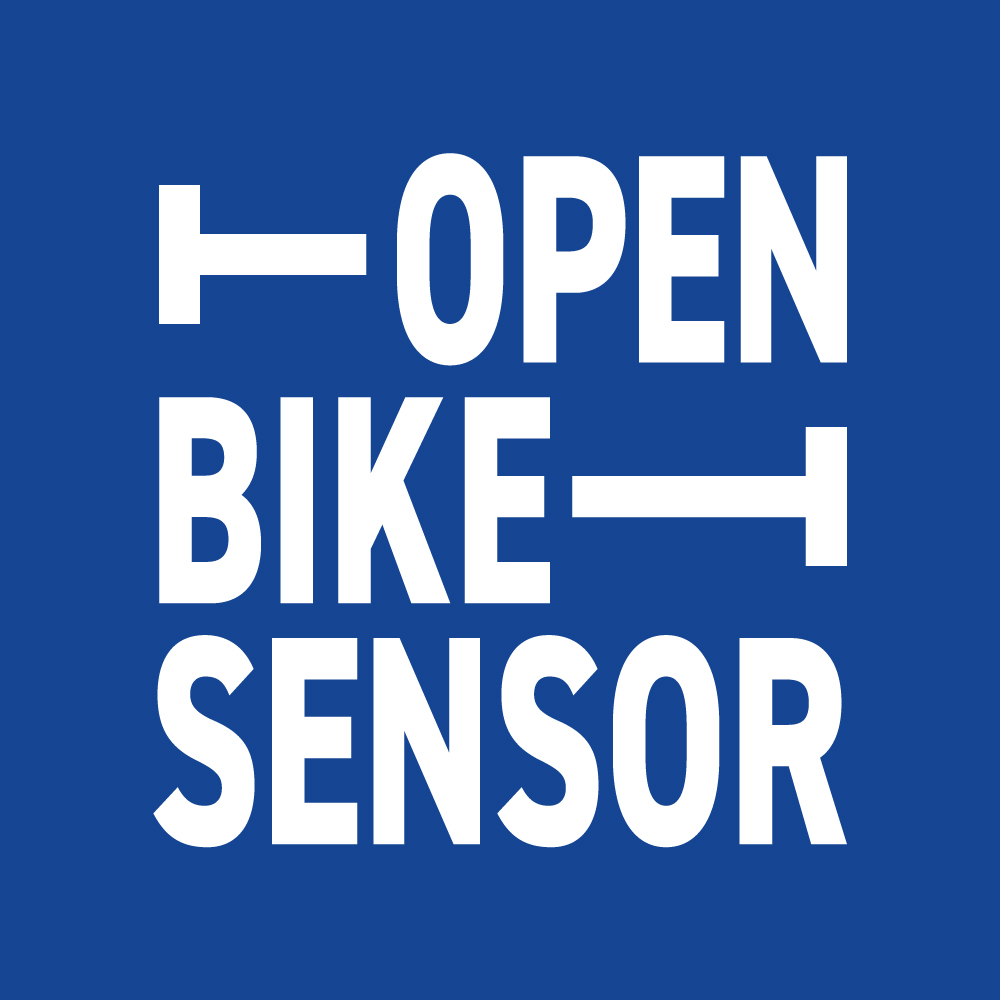

# OpenBikeSensor Logogramm & Logo

<i><a href="#english">English version below</a></i>

### Herkunft & Designer

Das Logo für das Open Citizen Science Projekt <a href="https://github.com/openbikesensor" alt="OpenBikeSensor" rel="noopener noreferrer nofollow">OpenBikeSensor</a> wurde entwickelt von <a href="https://github.com/turbo-distortion/OpenBikeSensor-Logo" alt="turbo-distortion / OpenBikeSensor-Logo" rel="noopener noreferrer nofollow">Lukas Betzler</a>. Es entstand ursprünglich für das alternative Fahrrad-Forum <a href="https://zweirat-stuttgart.de" alt="Zweirat Stuttgart" rel="noopener noreferrer nofollow">Zweirat Stuttgart</a> / Deutschland.

### Logo Design Konzept

Das Logo nimmt Bezug auf die Idee des Überholabstandsmessers, ein Gerät, das den Überholabstand von Fahrzeugen zu Radfahrenden misst. Schriftart ist die <a href="https://www.linotype.com/de/5387937/din-2014-schriftfamilie.html" alt="Schriftart DIN 2014 via Monotype GmbH" rel="noopener noreferrer nofollow">DIN2014</a>, eine überarbeitete Version der Typo, die in Deutschland für die Beschriftung von Straßen und Verkehrswegen genutzt wird.

Die einzelnen Glyphen wurden dabei gestreckt &mdash; wie Du es von Asphalt-Beschriftungen zum Beispiel für Bus- oder auch Taxi-Spuren kennst. Die drei Worte, arrangiert in einzelnen Spuren, sind wiederum im Quadrat angeordnet als Referenz auf das viereckige Gehäuse des Sensors selbst. Der verbleibende Raum in dieser engen Situation wird von den Maßlinien eingenommen, die ihrerseits die Abstände symbolisieren.

### Nutzungsbedingungen

Dieses Logo kann und soll für alle Vorhaben, Geräte und Programme des Open Citizen Science Projekt <a href="https://github.com/openbikesensor" alt="OpenBikeSensor" rel="noopener noreferrer nofollow">OpenBikeSensor</a> verwendet werden, solange die dort vorgegebenen Lizenzbestimmungen (LGPL) eingehalten werden und Du Dich unserer Hacking Ethik in Dienst stellst.

Aufbauend auf den Gestaltungsoptionen unter einer <a rel="license" href="http://creativecommons.org/licenses/by-sa/4.0/">Creative Commons Lizenz mit Namensnennung, Teilen unter gleichen Bedingungen 4.0 international</a> (CC-BY-SA 4.0 international), die uns freundlicherweise Lukas ermöglicht, bist Du in Deiner Gestaltung frei. Bitte stelle dabei sicher, dass Du den im Style Guide festgeschriebenen Gestaltungsgrundsätzen folgst. Die aktuelle Version findest Du in diesem Repository unter <a href="https://github.com/openbikesensor/OpenBikeSensor_StyleGuide/tree/main/_Style-Guide" alt="OpenBikeSensor Style Guide (Gestaltungsrichtlinien)" rel="noopener noreferrer nofollow">OpenBikeSensor Style Guide</a> (Gestaltungsrichtlinien), Seite 13f.

Die am häufigsten benötigten Varianten für die Darstellung auf Bildschirmen bzw. im Netz sowie für den Druck findest Du in den Ordnern wie folgt:

* <a href="./Logogramm">Logogramm</a> (Logo mit Schriftzug, Standard)
* <a href="./Logo">Logo</a> (Kurzform des Akronyms, für besonders kleine Darstellungen)

Fühle Dich frei, bei Fragen, Anregungen, Wünschen hier entsprechende <a href="https://github.com/openbikesensor/OpenBikeSensor_StyleGuide/issues">issues</a> zu öffnen oder auch direkt auf uns zuzukommen:
info@openbikesensor.org
https://OpenBikeSensor.org

Wir wünschen Dir viel Freude mit unserem Logo!

- - -

### Origin & Designer

This logo was created by <a href="https://github.com/turbo-distortion/OpenBikeSensor-Logo" alt="turbo-distortion / OpenBikeSensor-Logo" rel="noopener noreferrer nofollow">Lukas Betzler</a> as a contribution to the open citizen science project <a href="https://github.com/openbikesensor" alt="OpenBikeSensor" rel="noopener noreferrer nofollow">OpenBikeSensor</a>. It originates out of the cycling initiative <a href="https://zweirat-stuttgart.de" alt="Zweirat Stuttgart" rel="noopener noreferrer nofollow">Zweirat Stuttgart</a> in Germany.

### Concept of the logo design

The concept of the logo is based on the idea of the respective sensor, a small electronic device attached to a bicycle that measures and records the distance to passing vehicles during the ride. The font is the DIN2014, a redesigned version of the typeface used in german road signage. 

In the logo the gylphs are stretched like one might recognise from the signage painted directly on the tarmac, e.g. bus or taxi lanes. The three words, arranged in lanes, are put into a square as a reference to the boxy appearance of the sensor itself. The space that remains in this tight situation is filled up by the lines that mark the distance. 

### When and how to use it

You may and shall use this logo for all projects, activities, software and hardware in connection with the citizen science project <a href="https://github.com/openbikesensor" alt="OpenBikeSensor" rel="noopener noreferrer nofollow">OpenBikeSensor</a> as long as you comply to the general licence agreements (LGPL) of the community and their sources as well as our hacking ethics.

Building on the <a rel="license" href="http://creativecommons.org/licenses/by-sa/4.0/">Creative Commons Attribution-ShareAlike 4.0 International License</a>, Lukas contributed to the project, you are free to create your own design. Please make sure to follow the general rules and guidelines the community provides for the project. The current version you will find in the respective repository via <a href="https://github.com/openbikesensor/OpenBikeSensor_StyleGuide/tree/main/_Style-Guide" alt="OpenBikeSensor Style Guide" rel="noopener noreferrer nofollow">OpenBikeSensor Style Guide</a>, page 13f.

The most frequent and commonly used variations of the logo for screen and print design you may find in the folders as follows:

* <a href="./Logogramm">Logogramm</a> (Logo with  logotype, wordmark, lettermark)
* <a href="./Logo">Logo</a> (short version with the acronym)

Please feel free to open an <a href="https://github.com/openbikesensor/OpenBikeSensor_StyleGuide/issues">issue</a> for further questions, ideas and requests or contact us directly via
info@openbikesensor.org
https://OpenBikeSensor.org

Have fun using our logo! 

# Lizenz des / License of the original logo by Lukas Betzler

 The logo design of OpenBikeSensor is licensed under a <a rel="license" href="http://creativecommons.org/licenses/by-sa/4.0/">Creative Commons Attribution-ShareAlike 4.0 International License</a>. Please attribute any distribution or derivative to Lukas Betzler / OpenBikeSensor: https://openbikesensor.org

Source original logo design by Lukas: 
https://github.com/turbo-distortion/OpenBikeSensor-Logo

